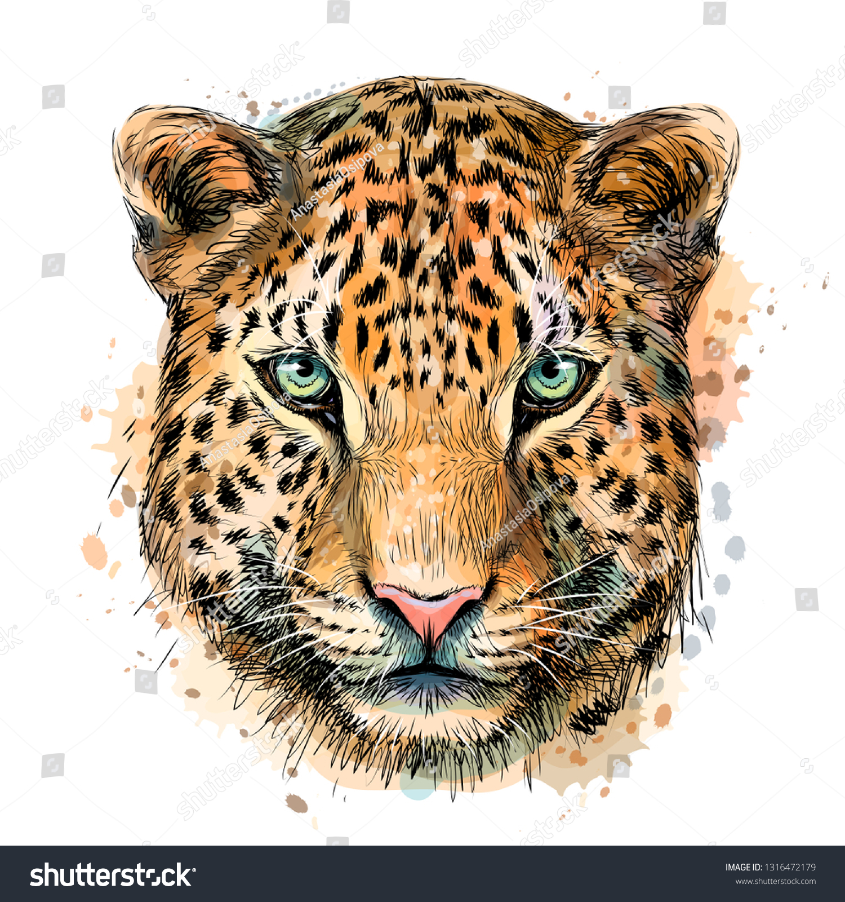

```{r out.width='50%', echo=FALSE, fig.align='center'}


```


<!-- Global site tag (gtag.js) - Google Analytics -->
<script async src="https://www.googletagmanager.com/gtag/js?id=UA-168723787-1"></script>
<script>
  window.dataLayer = window.dataLayer || [];
  function gtag(){dataLayer.push(arguments);}
  gtag('js', new Date());

  gtag('config', 'UA-168723787-1');
</script>

<br>


**WELA: Women Editors in Latin America** 

Las mujeres deben escribir de ellas mismas: deben escribir sobre las mujeres y traer
a las mujeres a la escritura, de donde han sido separadas tan violentamente como
lo han sido de sus propios cuerpos –por esas mismas razones, por la misma ley,
con la misma meta fatal. La mujer debe ponerse ella misma dentro del texto –así
como dentro del mismo mundo y dentro de la misma historia– por su mismo movimiento.
Helén Cixous


La palabra Wela en Mapuche se usa para indicar que se dejó de realizar una acción, o (adv.) despues. 

En guarijío significa Viejita. El guarijío, es una lengua utoazteca hablada por aproximadamente 1313 personas en el noroeste de México, muchos de los cuales, especialmente mujeres, son monolingües.

Para nosotras WELA significa frenar la desigualdad y transmitir la fuerza, sabiduria, y lucha que destellan los ojos de nuestras abuelas. 
