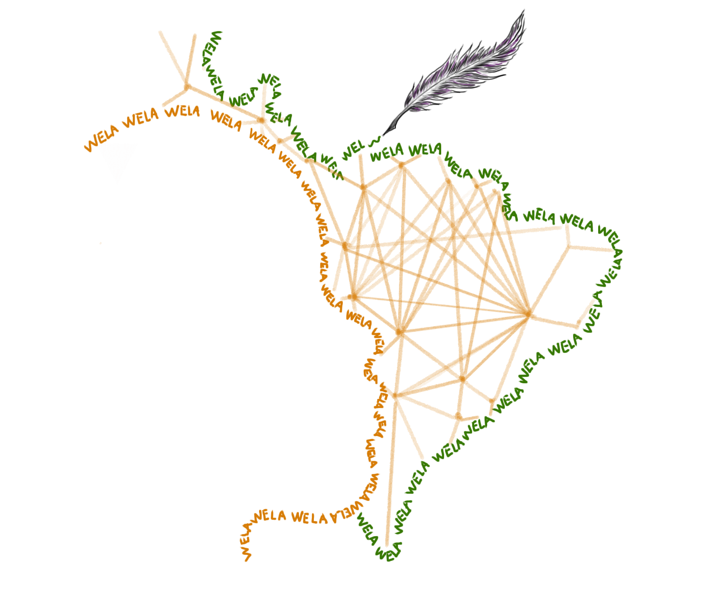

```{r out.width='75%', echo=FALSE, fig.align='center'}


```

<style type="text/css">
  body{
  font-size: 12pt;
}
</style>


```{r setup, include = FALSE}
knitr::opts_chunk$set(echo = TRUE)
```
El objetivo de esta base de datos es promover la participación de más mujeres latinoamericanas en las actividades de publicación y edición de revistas científicas. 

Queremos: 


- Generar un directorio de libre y fácil acceso con información sobre las mujeres que actúan o que pueden actuar en los equipos editoriales de publicaciones académicas en América Latina.

- Promover estrategias contra sesgos inconscientes y brechas de género en la participación de mujeres latinoamericanas en las labores editoriales y de publicaciones científicas. 

- Incrementar la diversidad e igualdad en los equipos editoriales de revistas científicas en América latina.

- Ayudar a identificar a mujeres académicas/científicas excepcionalmente calificadas que pueden formar parte de los comités/consejos editoriales, actuar como revisoras de manuscritos o invitarlas a escribir artículos de revisión en las revistas académicas. 

- Apoyar la creación de eventos, cursos y generar programas enfocados en la formación de más científicas latinoamericanas que actúen en el ambiente editorial.

- Promover la formación de asociaciones y redes de mujeres científicas a nivel regional para trabajar juntas por paridad en los puestos de liderazgo en las publicaciones científicas. 


La base de datos fue una iniciativa de [Lina Caballero-Villalobos](https://www.researchgate.net/profile/Lina_Caballero2), [Karem López-Hervas](https://twitter.com/KaremmLoHe) y [Luisa Liévano-Latorre](https://www.researchgate.net/profile/Luisa_Latorre) mujeres científicas promoviendo cambios desde la cotidianidad.

WELA cuenta con el apoyo de [Parent in Science Colombia](https://www.parentinsciencecol.com). La base de datos es mantenida y actualizada por Lina Caballero-Villalobos.

Agradecemos la bella colaboración de [Edna M. Pinzón R.](ilustraemi.kairos@gmail.com)  por dar vida a la [imagen de WELA](https://www.instagram.com/ilustraemi_kairos/). Así como al [Dr. Gustavo Silva Arias](@gutasilva82) por su apoyo en ajustes de website de WELA.

Puedes contactar con nosotras a través de nuestro correo electrónico editoraswela@gmail.com o por nuestras redes sociales [editorasWELA](https://twitter.com/editorasWELA).


Esta base de datos está inspirada por iniciativas como: [gage](https://gage.500womenscientists.org/), [Mitowomen](https://mitowomen.org/index.html), [Women in Malaria](https://www.womeninmalaria.org/), [Women in Soil Science](https://franciskadevries.wordpress.com/women-in-soil-science/) y [WiPara](https://wipara.weebly.com/). Este sitio web está hecho con [Rmarkdown](https://bookdown.org/yihui/rmarkdown/rmarkdown-site.html) con base en el código de [Mitowomen](https://mitowomen.org/index.html). 
